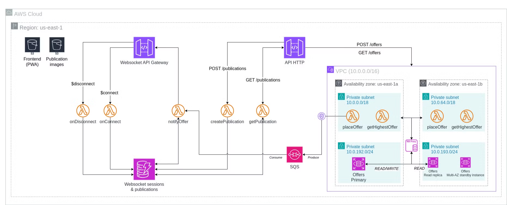
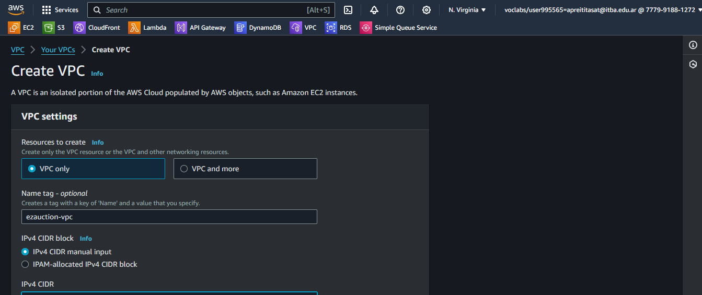
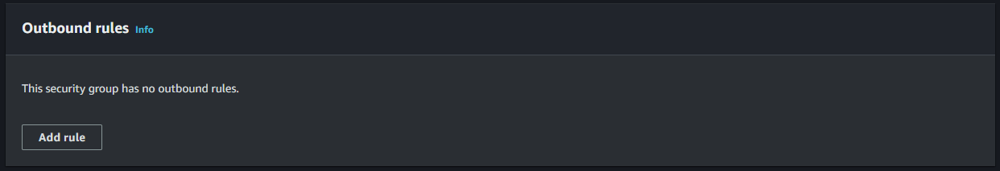
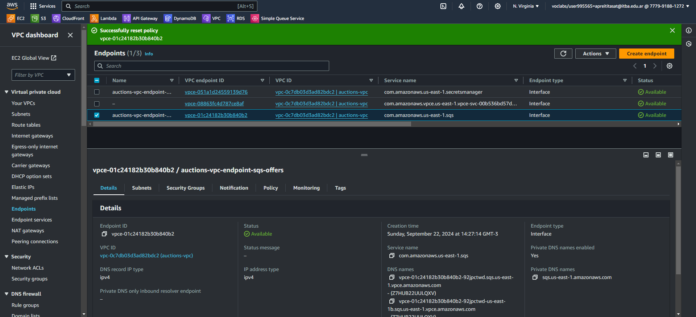

# Entrega 01: AWS Console
# Arquitectura



# How-To: EzAuctions

# 1. VPC

## 1.1. Creación de la VPC

Ir a la sección VPC y creemos una VPC nueva, clickeando en “Create VPC”

- **Tipo**: “VPC only”
- **Nombre**: ezauction-vpc
- **IPv4 CIDR**: 10.0.0.0/16
- **IPv6 CIDR block**: No IPv6 CIDR block
- **Tenancy:** Default

Clickear en “Create VPC”



## 1.2. Creación de las tablas de ruteo

Dentro del dashboard de VPC, ir a “Route tables” y crearemos la tabla de ruteo para la subred en la que se encontrará la BD RDS.

Clickeamos en “Create route table”

- **Nombre**: ezauction-route-table-rds
- **VPC**: ezauction-vpc

Clickeamos en “Create route table”. Autómaticamente, la tabla tendrá una única entrada que permite la comunicación en la red interna de la VPC.

Creamos una tabla de ruteo idéntica para la subred en la que se encontrará la función lambda, con el nombre ezauction-route-table-lambda.

## 1.3. Creación de las subredes

Cumpliendo con la alta disponibilidad, crearemos:

- Dos subredes para las BDs RDS, una en cada AZ
    - 10.0.192.0/24
    - 10.0.193.0/24
- Dos subredes para las lambdas, una en cada AZ
    - 10.0.0.0/18
    - 10.0.64.0/18

En el dashboard de VPC, ir a la sección subnets y clickear en “Create subnet”

- **VPC**: ezauction-vpc
- **Subnet RDS a**
    - **Nombre:** ezauction-subnet-rds-a
    - **AZ**: us-east-1a
    - **IPv4 Subnet CIDR**: 10.0.192.0/24
- **Subnet RDS b**
    - **Nombre:** ezauction-subnet-rds-b
    - **AZ**: us-east-1b
    - **IPv4 Subnet CIDR**: 10.0.193.0/24
- **Subnet Lambda a**
    - **Nombre:** ezauction-subnet-lambda-a
    - **AZ**: us-east-1a
    - **IPv4 Subnet CIDR**: 10.0.0.0/18
- **Subnet Lambda b**
    - **Nombre:** ezauction-subnet-lambda-b
    - **AZ**: us-east-1b
    - **IPv4 Subnet CIDR**: 10.0.64.0/18

Clickeamos en “Create subnet”

Actualizamos las tablas de ruteo de las subredes por las creadas en el paso anterior:

- ezauction-route-table-rds
    - ezauction-subnet-rds-a
    - ezauction-subnet-rds-b
- ezauction-route-table-lambda
    - ezauction-subnet-lambda-a
    - ezauction-subnet-lambda-b

# 2. RDS

## 2.1. Creación de EC2

Para poder crear las tablas en la instancia RDS vamos a necesitar una sencilla instancia EC2 que se conecte a la BD y ejecute un script SQL que cree las tablas necesarias (en este MVP, simplemente la tabla *offers*).

### 2.1.1. Security Group

Primero, vamos a crear el SG para la instancia EC2 que permita la comunicación por el puerto 5432 con la instancia RDS y que nos permita conectarnos desde nuestra IP por SSH.

Vamos a la sección “Security groups” del recurso VPC y clickeamos en “Create security group”

- **Name**: ezauction-sg-rds-ec2
- **Description**: Allow connection to RDS instance through EC2 via SSH
- **VPC**: ezauction-vpc
- **Inbound rules**: Conexión SSH desde nuestra IP
    
    
    
- **Outbound rules**: Por ahora, como no tenemos creado el SG para RDS permitiremos cualquier conexión por el puerto 5432 (default de postgres) dentro de la VPC. También permitiremos la conexión a Internet.
    
    
    

Clickeamos en “Create security group”.

Luego, para poder conectarnos a ella, vamos a necesitar una subred pública por lo que debemos crear una subred pública con su tabla de ruteo y un IGW para la VPC

<aside>
📖

Reutilizaremos la subred pública que haremos para las lambdas de pagos en futuras iteraciones del proyecto

</aside>

### 2.1.2. Internet Gateway

En la sección “Internet gateways”, clickeamos “Create internet gateway”

- **Name**: ezauction-igw

Clickeamos “Create internet gateway”. En el mensaje de creación, nos aparecerá el botón “Attach to a VPC” 


Lo clickeamos

- **Available VPCs**: ezauction-vpc

Clickeamos “Attach internet gateway”

### 2.1.3. Tabla de ruteo

En la sección “Route tables”, clickeamos en “Create route table”

- **Name:** ezauction-route-table-public
- **VPC**: ezauction-vpc

Clickeamos en “Create route table”. Luego, editamos sus rutas, clickeando en “Edit routes”. Agregamos una ruta con 

- Destino 0.0.0.0/0
- Target Internet Gateway (ezauction-igw)


Clickeamos en “Save changes”

### 2.1.4. Subred

En la sección “Subnets”, clickeamos “Create subnet”

- **VPC:** ezauction-vpc
- **Name**: ezauction-subnet-public-a
- **AZ**: us-east-1a
- **IPv4 subnet CIDR block**: 10.0.128.0/19

Clickeamos en “Create subnet”. La seleccionamos y editamos su route table, clickeando en “Edit route table association” y elegiendo la route table ezauction-route-table-public. Clickeamos en “Save”

### 2.1.5. EC2

Ahora, vamos al recurso EC2 y creamos una instancia, clickeando en “Launch instances”

- **Name**: ezauction-ec2-rds
- **AMI**: Amazon Linux 2023 AMI (Arquitectura x86 64-bit)
- **Instance type**: t2.micro
- **Key pair**: Creamos un par nuevo
    - **Name**: ezauction-key-pair-ec2-rds
    - **Type**: ED25519
    - **Format**: .pem
    - Clickeamos en “Create key pair” y guardamos la clave en un lugar seguro.
    - Automáticamente, se elegirá el par creado
- **Network settings**: Lo editamos
    - **VPC**: ezauction-vpc
    - **Subnet**: ezauction-subnet-public-a
    - **Auto-assign public IP**: Enable
    - **Firewall**: Select existing security group
    - **Common security groups**: ezauction-sg-rds-ec2
    - **Storage**: Default
    - **Advanced details**: Default

Clickeamos en “Launch instance”. Por ahora dejamos la instancia, luego ingresaremos por SSH para crear la tabla en la instancia RDS.

## 2.2. SG del RDS Proxy

Crearemos el SG que solo permitirá a las lambdas internas acceder a las instancias RDS mediante el RDS Proxy que crearemos en futuros pasos.

En el dashboard de VPC, ir a la sección Security groups. Clickear en “Create security group”

- **Name**: ezauction-sg-rds-proxy
- **Description**: Allow VPC lambdas access the RDS instance through the RDS Proxy
- **VPC**: ezauction-vpc
- **Inbound rules**: Por ahora, como no tenemos creado el SG para lambdas permitiremos cualquier conexión por el puerto 5432 (default de postgres)
    
    
    
- **Outbound rules**: Por ahora, como no tenemos creado el SG para RDS permitiremos cualquier conexión por el puerto 5432 (default de postgres)
    
    
    

Clickeamos en “Create security group”

## 2.3. SG del RDS

Crearemos el SG que permitirá al RDS comunicarse con el RDS Proxy

En el dashboard de VPC, ir a la sección Security groups. Clickear en “Create security group”

- **Name**: ezauction-sg-rds
- **Description**: Allow RDS proxy connect to RDS instances
- **VPC**: ezauction-vpc
- **Inbound rules**: Permitiremos la conexión por el puerto 5432 del SG del RDS Proxy (auctions-sg-rds-proxy) y la conexión por el puerto 5432 para la instancia EC2.
    
    
    
- **Outbound rules**: Ninguna.
    
    
    

Clickeamos en “Create security group”.

Dado que configuraremos replicación, deberemos habilitar el puerto 5432 para comunicarse entre ellos, es decir este SG. Por lo tanto, editamos la reglas inbound y outbound.


Actualizamos el SG del RDS Proxy y de la instancia EC2, para que su outbound rule sea solo hacia el SG de las instancias RDS.


Outbound rules del SG de RDS Proxy


Outbound rules del SG de EC2

<aside>
👁️

Para esto último, es probable que se deba borrar la regla original y regenerarla indicando el SG de las instancias RDS.

</aside>

## 2.4. DB Subnet group

Un subnet group es el conjunto de subnets donde se pueden crear las instancias de RDS. Crearemos uno para indicar las subredes ezauction-subnet-rds-… como las subredes donde se deben crear las instancias RDS.

Vamos al servicio RDS y a la sección “Subnet groups”. Clickeamos en “Create DB subnet group”

- **Name**: ezauction-rds-subnet-group
- **Description**: Subnet group for RDS instances
- **VPC**: ezauction-vps
- **AZs**: us-east-1a y us-east-1b
- **Subnets**: 10.0.192.0/24 y 10.0.193.0/24
    
    
    

Clickeamos en “Create”.

## 2.5. Creación del RDS

Vamos al servicio RDS y a la sección “Databases”.

Clickeamos en “Create database”:

- **Method**: Standard create
- **Engine**: PostgreSQL
    
    <aside>
    📖
    
    ¿Por qué no Aurora? En clase vimos que resulta mucho más costoso al principio cuando el uso de IO ops es bajo
    
    </aside>
    
- **Show versions that support the Multi-AZ DB cluster**: Deshabilitado
- **Version**: PostgreSQL 16.3-R2
- **Enable RDS Extended Support**: Deshabilitado
- **Templates**: Free tier
    
    <aside>
    👁️
    
    Los otros templates no se pueden usar en el Lab
    
    </aside>
    
- **Availability and durability**: Single DB instance
    
    <aside>
    📖
    
    ¿Por qué no Multi-AZ DB? Free tier no lo permite :( 
    
    </aside>
    
- **DB instance identifier**: ezauction-rds-db-primary
- **Master username**: postgres
- **Credential management**: Self managed
- **Auto generate password**: Deshabilitado
- **Master password**: PostgreS-2024
- **DB instance class**: Burstable classes (db.t3.micro)
- **Storage**
    - **Storage type**: gp3 (General Purpose SSD)
    - **Allocated storage**: 20 GiB
    - **Advanced settings**: No se pueden cambiar
    - **Storage autoscaling**
        - **Enable storage autoscaling**: Habilitado
        - **Maximum storage threshold**: 1000 GiB
- **Connectivity**
    - **Compute resource**: Don’t connect to an EC2 compute resource
    - **VPC**: ezauction-vpc
    - **DB subnet group**: ezauction-rds-subnet-group
    - **Public access**: No
    - **VPC security group**: Choose existing
    - **Existing VPC security groups**: Eliminar default y elegir ezauction-sg-rds
    - **Availability Zone**: us-east-1a
    - **RDS proxy**: Deshabilitado
    - **Certificate authority**: Default
- **Database authentication:** Password authentication
- **Turn on Performance Insights**: Deshabilitado
- **Additional configuration**
    - **Initial database name:** ezauction
    - **DB parameter group**: default:postgres-16
    - **Backup**
        - **Enable automated backups**: Habilitado
        - **Backup retention period**: 1 day
        - **Backup window**: Choose a window
        - **Start time**: 06:00 UTC (03:00 Arg)
        - **Duration**: 3 hours (hasta las 06:00 de Arg)
        - **Copy tags to snapshots**: Habilitado
        - **Enable replication in another AWS Region**: Deshabilitado
        - **Enable encryption**: Habilitado
        - **AWS KMS key**: Default
        - **Log exports**: PostgreSQL y Upgrade habilitados
    - **Maintenance**
        - **Enable auto minor version upgrade**: Habilitado
        - **Maintenance window**: Choose a window
        - **Start day**: Sunday
        - **Start time**: 09:00 UTC (06:00 Arg)
            
            <aside>
            📖
            
            ¿Por que no antes? No se pueden solapar las ventanas de backup y mantenimiento
            
            </aside>
            
        - **Duration**: 2 hours
    - **Enable deletion protection**: Habilitado

Clickeamos en “Create database” y esperamos a que su status sea **Running**. 

Una vez creada, nos mostrará un botón que nos dará los detalles de conexión a la DB

- Master username
- Master password
- Endpoint

## 2.6. Creación del RDS Proxy

Dado que la comunicación con la instancia será mediante lambdas, necesitamos contar con un proxy que mantenga puertos abiertos para evitar el retardo inicial en el llamado de las funciones.

Crearemos un Proxy, en la sección Proxies, clickeando en “Create proxy”

- **Engine family**: PostgreSQL
- **Proxy identifier**: ezauction-rds-proxy
- **Idle client connection timeout**: 5 minutes
- **Database**: ezauction-rds-db-primary
- **Connection pool maximum connections**: 100
- **Additional target group configuration**
    - **Connection borrow timeout**: 2 minutes
    - **Initialization query**: Vacío
- **Authentication**
    - **Identity and access management (IAM) role**: LabRole
    - **Secrets Manager secrets**
        - Creamos un secreto nuevo y nos redirigirá al formulario de creación
        - **Secret type**: Credentials for Amazon RDS database
        - **Credentials**
            - **User name**: postgres
            - **Password**: PostgreS-2024
        - **Encryption key**: aws/secretsmanager
        - **Database**: ezauction-rds-db-primary
        - Clickeamos en Next
        - **Secret name**: ezauction-rds-secret
        - **Description**: Access to RDS primary instance
        - **Resource permissions**: Vamos a permitir solamente al rol LabRole leer el secreto
            
            ```json
            {
              "Version": "2012-10-17",
              "Statement": [
                {
                  "Effect": "Allow",
                  "Principal": {
                    "AWS": "arn:aws:iam::777991881272:role/LabRole"
                  },
                  "Action": "secretsmanager:GetSecretValue",
                  "Resource": "*"
                }
              ]
            }
            ```
            
            <aside>
            💡
            
            Para obtener el ARN del rol LabRole, ir al recurso IAM, en la sección “Roles” elegir el rol “LabRole” y copiar su ARN
            
            </aside>
            
            Clickeamos en “Save”
            
        - Clickeamos en Next
        - **Automatic rotation**: Deshabilitado
        - Clickeamos en Next
        - Nos mostrará un resumen de la configuración y un ejemplo de código para usar el secreto
            
            ```tsx
            // Use this code snippet in your app.
            // If you need more information about configurations or implementing the sample code, visit the AWS docs:
            // https://docs.aws.amazon.com/sdk-for-javascript/v3/developer-guide/getting-started.html
            
            import {
              SecretsManagerClient,
              GetSecretValueCommand,
            } from "@aws-sdk/client-secrets-manager";
            
            const secret_name = "ezauction-rds-secret";
            
            const client = new SecretsManagerClient({
              region: "us-east-1",
            });
            
            let response;
            
            try {
              response = await client.send(
                new GetSecretValueCommand({
                  SecretId: secret_name,
                  VersionStage: "AWSCURRENT", // VersionStage defaults to AWSCURRENT if unspecified
                })
              );
            } catch (error) {
              // For a list of exceptions thrown, see
              // https://docs.aws.amazon.com/secretsmanager/latest/apireference/API_GetSecretValue.html
              throw error;
            }
            
            const secret = response.SecretString;
            
            // Your code goes here
            ```
            
        - Clickeamos en “Store”
        - Volvemos a la pestaña de creación del RDS Proxy, recargamos y elegimos el secret creado
    - **Client authentication type**: SCRAM SHA 256
    - **IAM authentication**: Not Allowed
- **Connectivity**
    - **Require Transport Layer Security**: Habilitado
    - **Subnets**: Elegimos las subnets ezauction-subnet-rds-…
    - **Additional connectivity configuration**
        - **VPC security group**: Choose existing
        - **Existing VPC security groups**: ezauction-sg-rds-proxy
- **Enhanced logging**: Deshabilitado

Clickeamos en “Create proxy”

## 2.7. Creación de la read replica

Desde el detalle de la BD, en la sección Actions, elegir la opción “Create read replica”

- **Replica source**: ezauction-rds-db-primary
- **DB instance identifier**: ezauction-rds-db-replica
- **DB instance class:** Burstable classes (db.t3micro)
- **Destination Region:** US East (N. Virginia)
- **Storage**
    - **Storage type**: gp3 (General Purpose SSD)
    - **Allocated storage**: 20 GiB
    - **Advanced settings**: No se pueden cambiar
    - **Storage autoscaling**
        - **Enable storage autoscaling**: Habilitado
        - **Maximum storage threshold**: 1000 GiB
- **Deployment options**: Single DB instance
- **Connectivity**
    - **Network type**: IPv4
    - **DB subnet group**: ezauction-rds-subnet-group
    - **Public access**: Not publicly accessible
    - **Existing VPC security groups**: ezauction-sg-rds
    - **Availability Zone**: us-east-1b
    - **Certificate authority**: Default
- **Database authentication:** Password authentication
- **Additional configuration**
    - **Backup**
        - **Copy tags to snapshots**: Habilitado
    - **Turn on Performance Insights**: Deshabilitado
    - **Log exports**: PostgreSQL y Upgrade habilitados
    - **Enable auto minor version upgrade**: Habilitado
    - **Enable deletion protection**: Habilitado

Clickeamos en “Create read replica”.

Una vez creada, veremos en el listado de databases como se linkea la replica a la instancia primaria


## 2.8. Multi-AZ instance

Al parecer si se puede configurar la instancia RDS para que permita Multi-AZ.

<aside>
📖

Para hacer la operación es necesario que la instancia primaria se encuentre en el estado **Available**

</aside>

Desde el detalle de la instancia primaria, en Actions, elegir la opción “Convert to Multi-AZ deployment”. Esto permitirá tener una Multi-AZ DB instance (replica en standby, inoperativa)

- **Schedule database modification**: Apply immediately

Clickeamos en “Convert to Multi-AZ” y esperamos a que el cambio se aplique.

## 2.9. Creación de tabla

Finalmente, vamos a conectarnos a la instancia RDS, a través de la instancia EC2, para crear la tabla de ofertas.

Desde una terminal, nos conectamos por SSH a la IP de la instancia EC2 utilizando el archivo .pem creado en el paso 1.0

```bash
ssh -i [Archivo PEM] ec2-user@[IP]
```

Para poder conectarnos a la instancia, necesitamos contar con los drivers de postgres

```bash
sudo dnf update
sudo dnf install postgresql15.x86_64 postgresql15-server
```

Nos conectamos a la instancia RDS

```bash
psql -h <URL copiada de la base de datos> -d ezauction -U postgres -p 5432
```

E ingresamos la password PostgreS-2024.

Veremos que si lanzamos el comando \d no se verá ninguna tabla, así que crearemos la tabla de ofertas.

```sql
CREATE TABLE offers (
    offer_id UUID PRIMARY KEY,
    publication_id VARCHAR NOT NULL,
    user_id VARCHAR NOT NULL,
    time TIMESTAMP NOT NULL,
    price NUMERIC NOT NULL,
    CONSTRAINT offers_unique UNIQUE (publication_id, user_id, time)
);
```

Ahora si ingresamos el comando `\d offers`, veremos la información de la tabla creada

```sql
ezauction=> \d offers
                             Table "public.offers"
     Column     |            Type             | Collation | Nullable | Default
----------------+-----------------------------+-----------+----------+---------
 offer_id       | uuid                        |           | not null |
 publication_id | character varying           |           | not null |
 user_id        | character varying           |           | not null |
 time           | timestamp without time zone |           | not null |
 price          | numeric                     |           | not null |
Indexes:
    "offers_pkey" PRIMARY KEY, btree (offer_id)
    "offers_unique" UNIQUE CONSTRAINT, btree (publication_id, user_id, "time")
```

Ya con esto, podemos hacer exit y salir de la instancia EC2.

<aside>
👁️

Por seguridad, sería conveniente sacar la entrada Outbound del SG del EC2 que permite la salida a Internet.

</aside>

## 2.10. Certificado SSL

<aside>
👁️

Esto ya estará en el repositorio, pero hay que acordarse de incluirlo en el archivo .zip al actualizar el código de la lambda

</aside>

Por seguridad, las instancias RDS deniegan conexiones que no son seguras (SSL). Dado que nos vamos a conectar a un RDS proxy, según [este foro de StackOverflow](https://stackoverflow.com/questions/78738574/error-unable-to-get-local-issuer-certificate-when-using-aws-rds-proxy), debemos crear un archivo PEM que incluya los PEM de todas las autoridades root.

[Amazon Trust Services Repository](https://www.amazontrust.com/repository/)

# 3. SQS

Vamos al recurso SQS y clickeamos en “Create queue”

- **Type**: Standard
- **Name**: ezauction-sqs-offers
- **Configuration**:
    - **Visibility timeout**: 1 minute
    - **Delivery delay**: 0 seconds
    - **Receive message wait time**: 5 seconds
    - **Message retention period**: 1 Hours
    - **Maximum message size**: 256 KB
- **Encryption**
    - **Server-side encryption**: Enabled
    - **Encryption key type**: Amazon SQS key
- **Access policy**
    - **Choose method**: Basic
    - **Define who can send messages to the queue**: Debemos permitir que las lambda puedan recibir y enviar mensajes a la cola, para ello vamos a permitir al rol LabRole tanto producir como consumir de la cola
        - Only the specified AWS accounts, IAM users and roles
    - **Define who can receive messages from the queue**: Análogo al anterior
    
    Tendremos la siguiente policy creada:
    
    ```json
    {
      "Version": "2012-10-17",
      "Id": "__default_policy_ID",
      "Statement": [
        {
          "Sid": "__owner_statement",
          "Effect": "Allow",
          "Principal": {
            "AWS": "777991881272"
          },
          "Action": [
            "SQS:*"
          ],
          "Resource": "arn:aws:sqs:us-east-1:777991881272:ezauction-sqs-offers"
        },
        {
          "Sid": "__sender_statement",
          "Effect": "Allow",
          "Principal": {
            "AWS": [
              "arn:aws:iam::777991881272:role/LabRole"
            ]
          },
          "Action": [
            "SQS:SendMessage"
          ],
          "Resource": "arn:aws:sqs:us-east-1:777991881272:ezauction-sqs-offers"
        },
        {
          "Sid": "__receiver_statement",
          "Effect": "Allow",
          "Principal": {
            "AWS": [
              "arn:aws:iam::777991881272:role/LabRole"
            ]
          },
          "Action": [
            "SQS:ChangeMessageVisibility",
            "SQS:DeleteMessage",
            "SQS:ReceiveMessage"
          ],
          "Resource": "arn:aws:sqs:us-east-1:777991881272:ezauction-sqs-offers"
        }
      ]
    }
    ```
    
- **Redrive allow policy:** Disabled
- **Dead-letter queue:** Disabled

Clickeamos en “Create queue”

# 4. Offers

## 4.1. VPC endpoint

Para que la funciones lambda VPC-inner puedan conectarse al SQS, será necesario crear un VPC endpoint hacia el recurso SQS. También será necesario crear un VPC endpoint para obtener los secrets de la RDS (username y password).

Pero primero, necesitaremos crear un SG para la ENI que se asignará a cada VPC endpoint. 

### 4.1.1. SG

Vamos al recurso VPC, en la sección Security groups, clickeamos en “Create security group”

- **Name**: ezauction-sg-vpc-endpoint
- **Description**: Allow lambdas to access VPC endpoints
- **VPC**: ezauction-vpc
- **Inbound rules**: Permitiremos mensajes HTTPS. Como no existe el SG de lambda, por ahora permitiremos desde cualquier IP de la VPC
    
    
    
- **Outbound rules**: Ninguna
    
    
    

Clickeamos en “Create security group”.

### 4.1.2. DNS resolution

También configuraremos la VPC para que permita la resolución de DNS. Vamos al detalle de la VPC ezauction-vpc, en el dropdown de “Actions”, elegimos la opción “Edit VPC settings” y en **DNS settings**, habilitamos ambos checkboxes.


Guardamos los cambios, clickeando “Save”.

### 4.1.3 SQS VPC endpoint

Vamos al recurso VPC, en la sección Endpoints, clickeamos en “Create endpoint”

- **Name**: ezauction-vpc-endpoint-sqs-offers
- **Service category**: AWS services
- **Services**: com.amazonaws.us-east-1.sqs
- **VPC**: ezauction-vpc
- **Additional settings**
    - **Enable DNS name**: Habilitado
    - **DNS record IP type**: IPv4
- **Subnets**
    - us-east-1a | ezauction-subnet-lambda-a
    - us-east-1b | ezauction-subnet-lambda-b
    - **IP address type**: IPv4
- **Security groups**: ezauction-sg-vpc-endpoint
- **Policy**: custom
Aprovechamos el código de la policy creada por SQS e ingresamos la siguiente policy que permite enviar mensajes a la cola
    
    <aside>
    👁️
    
    Colocar en `resource` el arn de la cola SQS. Usar el de abajo como ejemplo. No olvidar usar su arn del `LabRole` 
    
    </aside>
    
    ```json
    {
        "Statement": [
            {
                "Effect": "Allow",
                "Principal": {
                    "AWS": [
                        "arn:aws:iam::777991881272:role/LabRole"
                    ]
                },
                "Action": [
                    "sqs:sendmessage"
                ],
                "Resource": "arn:aws:sqs:us-east-1:777991881272:ezauction-sqs-offers"
            }
        ]
    }
    ```
    

Clickeamos en “Create endpoint”

### 4.1.4. Secrets VPC endpoint

Vamos al recurso VPC, en la sección Endpoints, clickeamos en “Create endpoint”

- **Name**: ezauction-vpc-endpoint-secrets
- **Service category**: AWS services
- **Services**: com.amazonaws.us-east-1.secretsmanager
- **VPC**: ezauction-vpc
- **Additional settings**
    - **Enable DNS name**: Habilitado
    - **DNS record IP type**: IPv4
- **Subnets**
    - us-east-1a | ezauction-subnet-lambda-a
    - us-east-1b | ezauction-subnet-lambda-b
    - **IP address type**: IPv4
- **Security groups**: ezauction-sg-vpc-endpoint
- **Policy**: custom
Aprovechamos el código de la policy creada por SQS e ingresamos la siguiente policy que permite enviar mensajes a la cola.
    
    <aside>
    👁️
    
    Colocar en `resource` el arn del secreto. Usar el de abajo como ejemplo. No olvidar usar su arn del `LabRole` 
    
    </aside>
    
    ```json
    {
        "Version": "2012-10-17",
        "Statement": [
            {
                "Effect": "Allow",
                "Principal": {
                    "AWS": "arn:aws:iam::777991881272:role/LabRole"
                },
                "Action": "secretsmanager:GetSecretValue",
                "Resource": "arn:aws:secretsmanager:us-east-1:777991881272:secret:ezauction-rds-secret-7pi5QV"
            }
        ]
    }
    ```
    

Clickeamos en “Create endpoint”

## 4.2. SG de lambdas

Debemos crear el SG que permita a las lambdas comunicarse con los VPC endpoints creados y con las instancias RDS.

Para ello, vamos a crear dos SGs, uno para cada permiso

### 4.2.1. VPC endpoint SG

En el panel de VPC, en la sección “Security groups”, clickeamos en “Create security group”

- **Name**: ezauction-sg-lambda-vpc-endpoint
- **Description**: Allow offers lambdas to communicate with VPC endpoints
- **VPC:** ezauction-vpc
- **Inbound rules**: Ninguna pues será invocada por el API Gateway
- **Outbound rules**:
    - Comunicarse con el SG del SQS VPC Endpoint por el puerto HTTPS
    
    
    

Editamos el SG de VPC endpoint (ezauction-sg-vpc-endpoint) para que solo permita la comunicación (inbound) desde este SG (ezauction-sg-lambda-vpc-endpoint)

### 4.2.2. RDS SG

En el panel de VPC, en la sección “Security groups”, clickeamos en “Create security group”

- **Name**: ezauction-sg-lambda-rds
- **Description**: Allow offers lambdas to communicate with RDS
- **VPC:** ezauction-vpc
- **Inbound rules**: Ninguna pues será invocada por el API Gateway
- **Outbound rules**:
    - Comunicarse con el SG del RDS Proxy por el puerto de PostgreSQL
    
    
    

Editamos el SG de RDS Proxy (ezauction-sg-rds-proxy) para que solo permita la comunicación (inbound) desde este SG (ezauction-sg-lambda-rds)

## 4.3. Lambda `placeOffer`

### 4.3.1. Creación de Lambda

Esta función debe recibir el id del producto, el id del usuario y el precio a ofertar.

La función deberá verificar que el precio sea la oferta más alta hasta el momento del producto y, en caso de serlo, actualizar la nueva oferta y enviar un mensaje a la cola para notificar al resto de los usuarios.

<aside>
👁️

Es importante hacer la operación a la DB de forma transaccional con el fin de garantizar que siempre se tendrá la oferta más alta colocada

</aside>

Vamos al recurso Lambda y clickeamos en “Create function”

- **Author from scratch**
- **Name**: ezauction-lambda-place-offer
- **Runtime**: Node.js 20.x
- **Architecture**: x86-64
- **Change default execution role**
    - **Execution role**: Use an existing role
    - **Existing role**: LabRole
- **Advanced settings**
    - **Enable Code signing:** Deshabilitado
    - **Enable function URL:** Deshabilitado
    - **Enable tags:** Deshabilitado
    - **Enable VPC:** Habilitado
    - **VPC**: ezauction-vpc
    - **Allow IPv6 traffic for dual-stack subnet**: Deshabilitado
    - **Subnets**:
        - ezauction-subnet-lambda-a
        - ezauction-subnet-lambda-b
    - **Security groups**:
        - ezauction-sg-lambda-rds
        - ezauction-sg-lambda-vpc-endpoint

Clickeamos en “Create function”.

Vamos a agregar cuatro variables de entorno con la información del endpoint de RDS proxy, sus credenciales y el endpoint de SQS. Para ello, vamos a “Configuration” > “Environment variables”. Clickeamos “Edit” y agregamos los siguientes campos:

| Key | Value |
| --- | --- |
| RDS_PROXY_HOST | [El endpoint del proxy RDS] |
| SQS_URL | [La URL de la cola SQS] |
| SECRET_NAME | ezauction-rds-secret |
| SQS_ENDPOINT | [Uno de los DNS Name creados al VPC endpoint de SQS (ezauction-vpc-endpoint-sqs-offers)]
 |



Ejemplo de DNS name de VPC Endpoint de un SQS


“Encryption configuration” dejamos el default y clickeamos en “Save”.

También, vamos a aumentar el tiempo de ejecución de la lambda (el cual es 3 segundos por default). Para ello, en “Configuration” > “General Configuration”, editamos el campo timeout.


### 4.3.2. Subida de código

Ir al repositorio del proyecto, en el subdirectorio backend/lambdas*/offers/placeOffer*, se tendrá el siguiente contenido

```json
- amazon-root-ca.pem
- index.ts
- package-lock.json
- package.json
- tsconfig.json
```

Primero, generar las dependencias:

```bash
npm ci
```

Esto agregará el directorio node_modules.

Luego, transpilar el archivo de TS a JS:

```bash
npm run compile
```

Esto generará dos archivos:

- index.js
- index.js.map

Luego, generar un archivo .zip que incluya

- node_modules
- index.js
- index.js.map
- amazon-root-ca.pem

Una vez generado el archivo ZIP, ir al detalle de la función lambda ezauction-lambda-place-offer y, en la sección “Code”, elegir la opción “Upload from” > “.zip file”


Subir el archivo .zip con el código y dependencias, y clickear “Save”. Esperar a que la función se actualice.

## 4.4. Lambda `getHighestOffer`

Se necesita una lambda que devuelva el precio más alto ofertado por una publicación. De esta manera, al ingresar al detalle de una publicación se conoce el precio anterior a abrir el websocket.

### 4.4.1. Creación de Lambda

Vamos al recurso Lambda y clickeamos en “Create function”

- **Author from scratch**
- **Name**: ezauction-lambda-get-highest-offer
- **Runtime**: Node.js 20.x
- **Architecture**: x86-64
- **Change default execution role**
    - **Execution role**: Use an existing role
    - **Existing role**: LabRole
- **Advanced settings**
    - **Enable Code signing:** Deshabilitado
    - **Enable function URL:** Deshabilitado
    - **Enable tags:** Deshabilitado
    - **Enable VPC:** Habilitado
    - **VPC**: ezauction-vpc
    - **Allow IPv6 traffic for dual-stack subnet**: Deshabilitado
    - **Subnets**:
        - ezauction-subnet-lambda-a
        - ezauction-subnet-lambda-b
    - **Security groups**:
        - ezauction-sg-lambda-rds
        - ezauction-sg-lambda-vpc-endpoint

Clickeamos en “Create function”.

Vamos a agregar dos variables de entorno con la información del endpoint de RDS proxy réplica y sus credenciales. Para ello, vamos a “Configuration” > “Environment variables”. Clickeamos “Edit” y agregamos los siguientes campos:

| Key | Value |
| --- | --- |
| RDS_PROXY_HOST | [El endpoint del proxy RDS] |
| DB_SECRET_NAME | ezauction-rds-secret |

También, vamos a aumentar el tiempo de ejecución de la lambda (el cual es 3 segundos por default). Para ello, en “Configuration” > “General Configuration”, editamos el campo timeout.

### 4.4.2. Subida de código

Ir al repositorio del proyecto, en el subdirectorio backend/lambdas*/offers/getHighestOffer*, se tendrá el siguiente contenido

```json
- amazon-root-ca.pem
- index.ts
- package-lock.json
- package.json
- tsconfig.json
```

Primero, generar las dependencias:

```bash
npm ci
```

Esto agregará el directorio node_modules.

Luego, transpilar el archivo de TS a JS:

```bash
npm run compile
```

Esto generará dos archivos:

- index.js
- index.js.map

Luego, generar un archivo .zip que incluya

- node_modules
- index.js
- index.js.map
- amazon-root-ca.pem

Una vez generado el archivo ZIP, ir al detalle de la función lambda ezauction-lambda-place-offer y, en la sección “Code”, elegir la opción “Upload from” > “.zip file”


Subir el archivo .zip con el código y dependencias, y clickear “Save”. Esperar a que la función se actualice.

## 4.5. API Gateway

Necesitamos crear un API Gateway que maneje las consultas HTTP de la función lambda.

### 4.5.1. Creación del API Gateway

Para ello, vamos al recurso “API Gateway” y hacemos click en “Build” de **HTTP API**

- **Integrations**
    - Lambda
    - **Region**: us-east-1
    - **Lambda function**: ezauction-lambda-place-offer
    - **Version**: 2.0
    - Clickeamos “Add integration”
    - Lambda
    - **Region**: us-east-1
    - **Lambda function**: ezauction-lambda-get-highest-offer
    - **Version**: 2.0
- **Name**: ezauction-api-http
- Clickeamos en Next
- **Configure routes**
    - **Method:** POST
    - **Resource path**: /offers
    - **Integration target**: ezauction-lambda-place-offer
    - **Method:** GET
    - **Resource path**: /offers
    - **Integration target**: ezauction-lambda-get-highest-offer
- Clickeamos en Next
- **Stage name:** prod
- **Auto-deploy**: Habilitado
- Clickeamos en Next

Clickeamos en “Create”.

### 4.5.2. CORS

Debemos deshabilitar CORS para que el browser pueda utilizar la API. Para ello, debemos ir a la sección “CORS” y clickear en “Configure”

- **Access-Control-Allow-Origin**: * (Clickear Add)
- **Access-Control-Allow-Headers**: * (Clickear Add)
- **Access-Control-Allow-Methods**: *
- **Access-Control-Expose-Headers**: * (Clickear Add)
- **Access-Control-Max-Age**: 0 seconds
- **Access-Control-Allow-Credentials**: No

Clickeamos “Save”

## 4.6. Probar lambda

Utilizar un agente HTTP para ejecutar el endpoint POST /offers.

Este debe cumplir con lo siguiente:

- Content-Type: application/json
- Body
    
    ```json
    {
        "publicationId": "pub987",
        "userId": "user987",
        "price": 100
    }
    ```
    

Deberíamos ver la entrada en la tabla de SQL 

```sql
auctions=> SELECT * FROM offers;
               offer_id               | publication_id | user_id |            time            |  price
--------------------------------------+----------------+---------+----------------------------+----------
 1434f859-1ced-4c39-b1cb-b5adb5c01371 | test           | test    | 1999-01-08 04:05:06        | 19380.45
 77d00709-9862-4717-ba9b-0207733112f5 | pub123         | user456 | 2024-09-22 23:40:35.094445 |      300
 bafe9050-75fe-43db-a543-bedb2cb52f26 | pub123         | user456 | 2024-09-22 23:44:52.727659 |      400
 49e48cc9-c4eb-4a10-acf6-d5805c552eb3 | pub123         | user456 | 2024-09-22 23:48:50.26649  |   450.43
 7a906e86-a359-4dc0-ad25-50143952462d | pub123         | user456 | 2024-09-22 23:49:46.320504 |      500
 64623c90-bd00-4ed4-9f02-9b26594457ea | pub123         | user456 | 2024-09-22 23:51:01.761172 |  500.129
 67cc463f-9aa6-4be5-8168-4a7432825692 | pub123         | user456 | 2024-09-22 23:57:17.341932 |      550
 7f5a0ebf-196b-4234-8e2c-11612c5288be | pub123         | user456 | 2024-09-23 00:06:15.795572 |      560
 f289e03d-f0d3-47ae-8b6a-dba820d4246f | pub987         | user987 | 2024-09-23 00:46:46.013244 |      100
(9 rows)
```

Y el mensaje en la cola SQS


# 5. Publications

## 5.1. DynamoDB

Vamos a crear una tabla de DynamoDB con la siguiente estructura

Nombre `PUBLICATIONS` 

| PK | SK | UserId | initialPrice | dueTime | title | description | createdAt | images |
| --- | --- | --- | --- | --- | --- | --- | --- | --- |
| PUBID# | DEFAULT |  |  |  |  |  |  |  |
|  |  |  |  |  |  |  |  |  |
|  |  |  |  |  |  |  |  |  |

Vamos al recurso DynamoDB y clickeamos “Create table”

- **Name:** PUBLICATIONS
- **Partition key**: PK (String)
- **Sort key**: SK (String)
- **Table settings**: Default settings

Clickeamos “Create table”

## 5.2. Bucket S3

Tendremos un bucket S3 para guardar las imagenes de las publicaciones.

Vamos al recurso S3 y clickeamos “Create bucket”

- **Bucket type**: General purpose
- **Bucket name**: `ezauction-publication-images`
- **ACLs enabled**
- **Object ownership**: Bucket owner preferred
- **Block *all* public access**: Deshabilitado
- “I acknowledge…”: Habilitado
- **Bucket Versioning**: Enable
- **Encryption type**: Server-side encryption with Amazon S3 managed keys (SSE-S3)
- **Bucket Key**: Enable

Clickeamos en “Create bucket”.

## 5.3. Lambda `createPublication`

Creemos la función que recibirá y manejará la creación de una publicación.

### 5.3.1. Creación de Lambda

Vamos al recurso “Lambda” y clickeamos en “Create function”:

- **Author from scratch**
- **Name**: ezauction-lambda-create-publication
- **Runtime**: Node.js 20.x
- **Architecture**: x86_64
- **Change default execution role**
    - **Execution role**: Use an existing role
    - **Existing role**: LabRole
- **Advanced settings**
    - **Enable Code signing:** Deshabilitado
    - **Enable function URL:** Deshabilitado
    - **Enable tags:** Deshabilitado
    - **Enable VPC:** Deshabilitado

Clickeamos en “Create function”.

Vamos a agregar dos variables de entorno para parametrizar el nombre del bucket y el nombre de la tabla de DynamoDB.

Vamos a la sección “Configuration” > “Environment variables”. Clickeamos “Edit” y agregamos los siguientes campos:

| Key | Value |
| --- | --- |
| BUCKET_NAME | [Nombre del bucket] |
| TABLE_NAME | PUBLICATIONS |

### 5.3.2. Subir código

En el repositorio, ir al directorio *backend/lambdas/publications/postPublications*

1. Ejecutar `npm ci`
2. Correr el script `create_deploy_zip.sh` para zippear el codigo con el node_modules
3. Volver a la lambda, en la sección “Code”. Vamos a tocar `Upload from` arriba a la derecha del codigo de la lambda y elegimos la opcion `.zip file`.

## 5.4. Lambda `getPublication`

Creemos la función que permitirá recuperar las publicaciones.

### 5.4.1. Creación de Lambda

Vamos al recurso “Lambda” y clickeamos en “Create function”:

- **Author from scratch**
- **Name**: ezauction-lambda-get-publication
- **Runtime**: Node.js 20.x
- **Architecture**: x86_64
- **Change default execution role**
    - **Execution role**: Use an existing role
    - **Existing role**: LabRole
- **Advanced settings**
    - **Enable Code signing:** Deshabilitado
    - **Enable function URL:** Deshabilitado
    - **Enable tags:** Deshabilitado
    - **Enable VPC:** Deshabilitado

Clickeamos en “Create function”.

Vamos a agregar una variable de entorno para parametrizar  el nombre de la tabla de DynamoDB.

| Key | Value |
| --- | --- |
| TABLE_NAME | PUBLICATIONS |

### 5.4.2. Subir código

En el repositorio, ir al directorio *backend/lambdas/publications/getPublications*

1. Copiar el código del archivo index.js
2. Clickear “Deploy”

## 5.5. API Gateway

Agregemos la ruta /publications al API Gateway creado en el paso 4.4. Se implementarán los métodos:

- /GET: ezauction-lambda-get-publication
- /POST: ezauction-lambda-create-publication

Vamos al recurso “API Gateway” y vamos al detalle de la API “ezauction-api-http”.

### 5.5.1. GET

En la sección ”Routes”, clickeamos en “Create”

- **Route name**: GET /publications

Clickeamos en “Create”.

Una vez creada, clickeamos en “Attach integration”

- Clickear “Create and attach an integration”
- **Integration type**: Lambda function
- **AWS Region**: us-east-1
- **Lambda function:** ezauction-lambda-get-publication
- **Grant API Gateway permission to invoke your Lambda function**: Habilitado

Clickeamos en “Create”

### 5.5.2. POST

En la sección ”Routes”, clickeamos en “Create”

- **Route name**: POST /publications

Clickeamos en “Create”.

Una vez creada, clickeamos en “Attach integration”

- Clickear “Create and attach an integration”
- **Integration type**: Lambda function
- **AWS Region**: us-east-1
- **Lambda function:** ezauction-lambda-create-publication
- **Grant API Gateway permission to invoke your Lambda function**: Habilitado

Clickeamos en “Create”

# 6. Websockets

## 6.1. DynamoDB

Creemos la tabla `USER_SESSIONS` que almacenará las conexiones Websockets abiertas. Es decir, 

- Al conectarse, se agrega una entrada con el id de la conexión
- Al desconectarse, se elimina la entrada del id de la conexión finalizada

La estructura a seguir es la siguiente:

Nombre `USER_SESSIONS` 

| PK | SK | pubId | userId |
| --- | --- | --- | --- |
| CONID#<connection_id> | “DEFAULT” |  | - |
| PUBID#<pubId> | CONID#<connectionId> | - |  |

Vamos al recurso “DynamoDB” y clickeamos en “Create table”

- **Name**: USER_SESSIONS
- **Partition key**: PK (String)
- **Sort key**: SK (String)
- **Table settings**: Default settings

Clickeamos “Create table”

## 6.2. Lambda `$connect`

Esta lambda maneja las nuevas conexiones WS

### 6.2.1. Creación de Lambda

Vamos al recurso “Lambda” y clickeamos en “Create function”

- **Author from scratch**
- **Name**: ezauction-lambda-connect-handler
- **Runtime**: Node.js 20.x
- **Architecture**: x86-64
- **Change default execution role**
    - **Execution role**: Use an existing role
    - **Existing role**: LabRole
- **Advanced settings**
    - **Enable Code signing:** Deshabilitado
    - **Enable function URL:** Deshabilitado
    - **Enable tags:** Deshabilitado
    - **Enable VPC:** Deshabilitado

Vamos a agregar una variable de entorno con la información del nombre de la tabla de DynamoDB. Para ello, vamos a “Configuration” > “Environment variables”. Clickeamos “Edit” y agregamos los siguientes campos:

| Key | Value |
| --- | --- |
| TABLE_NAME | USER_SESSIONS |

### 6.2.2. Subida de código

En el repositorio, ir al directorio *backend/lambdas/websocketConnect*

1. Copiar el código del archivo main.js
2. Clickear “Deploy”

## 6.3. Lambda `$disconnect`

Esta lambda maneja las desconexiones WS.

### 6.3.1. Creación de Lambda

Vamos al recurso “Lambda” y clickeamos en “Create function”

- **Author from scratch**
- **Name**: ezauction-lambda-disconnect-handler
- **Runtime**: Node.js 20.x
- **Architecture**: x86-64
- **Change default execution role**
    - **Execution role**: Use an existing role
    - **Existing role**: LabRole
- **Advanced settings**
    - **Enable Code signing:** Deshabilitado
    - **Enable function URL:** Deshabilitado
    - **Enable tags:** Deshabilitado
    - **Enable VPC:** Deshabilitado

Vamos a agregar una variable de entorno con la información del nombre de la tabla de DynamoDB. Para ello, vamos a “Configuration” > “Environment variables”. Clickeamos “Edit” y agregamos los siguientes campos:

| Key | Value |
| --- | --- |
| TABLE_NAME | USER_SESSIONS |

### 6.3.2. Subida de código

En el repositorio, ir al directorio *backend/lambdas/websocketDisconnect*

1. Copiar el código del archivo main.js
2. Clickear “Deploy”

## 6.4. WS API Gateway

Creamos el API Gateway que persistirá las conexiones WebSocket.

Vamos al recurso “API Gateway” y clickeamos en “Create API”

- Clickeamos “Build” de WebSocket API
- **Name**: ezauction-api-ws
- **Route selection expression**: request.body.action
- Clickeamos Next
- Clickeamos “Add $connect route” y “Add $disconnect route”
- Clickeamos Next
- **Integration for $connect**: Lambda | ezauction-lambda-connect-handler
- **Integration for $disconnect**: Lambda | ezauction-lambda-disconnect-handler
- Clickeamos Next
- **Stage name**: prod

Clickeamos “Create and deploy”.

## 6.5. Probar WS

En la sección “Stages” del API Gateway se puede obtener el **Websocket URL**. 

Luego, se debe agregar los query params:

- userId
- publicationId

Por lo que el template termina siendo:

`wss://your-websocket-api-id.execute-api.your-region.amazonaws.com/prod?userId=[USER_ID]&publicationId=[PUBLICATION_ID]`

# 7. Notifications

## 7.1. Lambda `notify`

Esta lambda se encargará de notificar cuando se publica una nueva oferta.

### 7.1.1. Creación de Lambda

Vamos al recurso “Lambda” y clickeamos en “Create function”

- **Author from scratch**
- **Name**: ezauction-lambda-notify
- **Runtime**: Node.js 20.x
- **Architecture**: x86-64
- **Change default execution role**
    - **Execution role**: Use an existing role
    - **Existing role**: LabRole
- **Advanced settings**
    - **Enable Code signing:** Deshabilitado
    - **Enable function URL:** Deshabilitado
    - **Enable tags:** Deshabilitado
    - **Enable VPC:** Deshabilitado

Vamos a agregar dos variables de entorno con la información del nombre de la tabla de DynamoDB y la URL del endpoint del WS API Gateway. Para ello, vamos a “Configuration” > “Environment variables”. Clickeamos “Edit” y agregamos los siguientes campos:

| Key | Value |
| --- | --- |
| TABLE_NAME | USER_SESSIONS |
| WS_API_GATEWAY_ENDPOINT | [URL HTTPS del WS API Gateway] |

### 7.1.2. Subida de código

En el repositorio, ir al directorio *backend/lambdas/notifications*

1. Copiar el código del archivo main.js
2. Clickear “Deploy”

## 7.2. Trigger

Desde la lambda, clickear en “Add trigger”

- **Source**: SQS
- **SQS Queue**: ezauction-sqs-offers
- El resto se deja en valores default

Clickeamos “Add”.

Tardará un tiempo en configurarse. Esto se puede ver en la sección “Configuration” > “Triggers”, donde se mostrará el estado del trigger.


Luego de un rato, clickear en “Recargar” y debería cambiar al estado “Enabled”


# 8. Frontend

## 8.1. Bucket S3

Creemos el bucket que hosteará el SPA.

Vamos al recurso “S3” y clickeamos en “Create bucket”.

- **Bucket type**: General purpose
- **Bucket name**: `ezauction-frontend`
- **ACLs disabled**
- **Block *all* public access**: Deshabilitado
- “I acknowledge…”: Habilitado
- **Bucket Versioning**: Disable
- **Encryption type**: Server-side encryption with Amazon S3 managed keys (SSE-S3)
- **Bucket Key**: Enable

Clickeamos en “Create bucket”.

## 8.2. Subida del SPA

En el repositorio, ir al directorio *frontend*.

Primero instalemos las dependencias:

```bash
yarn install
```

Debemos editar las constantes del proyecto para que se conecte correctamente a los API GWs. Para ello, vamos al archivo *frontend/src/constants.ts*  y, para el stage `"prod"`, editamos los campos:

- stage: `“prod"`
- HIGHEST_BID_WS_URL: `[URL del WS API Gateway]?userId=[userId generico]`
- API_GW_URL: `[URL del HTTP API Gateway]`

Después, buildeamos el proyecto:

```bash
yarn build
```

Esto generará el directorio *dist* con el contenido estático del SPA.

Vamos al detalle del bucket creado y clickeamos “Upload”. 

<aside>
❗

Se debe subir el contenido del directorio, NO el directorio en sí

</aside>

Clickeamos en “Add files” y subimos todos los archivos generados en el directorio dist:

```bash
- assets
- android-chrome-192x192.png
- android-chrome-512x512.png
- apple-touch-icon.png
- favicon.ico
- favicon.jpeg
- favicon.svg
- favicon-16x16.png
- favicon-32x32.png
- index.html
- logo.jpeg
- site.webmanifest
```

Y clickeamos en “Upload” y después “Close”.

<aside>
👁️

Para subir el directorio assets, subirlo con “Add folder”. Se deberán subir un archivo JS y otro CSS al directorio assets del bucket

</aside>

## 8.3. Configurar bucket como static web hosting

En el detalle del bucket, vamos a la sección “Properties”. En el último bloque está la propiedad “Static website hosting”.


Clickeamos en “Edit”

- **Static website hosting**: Enable
- **Hosting type**: Host a static website
- **Index document**: index.html
- **Error document**: index.html
    
    <aside>
    📖
    
    Esto es para que el router de la app maneje los paths distintos al path root
    
    </aside>
    

Clickeamos “Save changes”

Luego, vamos a permitir el acceso público al sitio web. Para ello, vamos a la sección “Permissions” y editamos el “Bucket policy” con el siguiente contenido:

```json
{
    "Version": "2012-10-17",
    "Statement": [
        {
            "Effect": "Allow",
            "Principal": "*",
            "Action": [
                "s3:GetObject"
            ],
            "Resource": [ "[Bucket ARN]/*" ]
        }
    ]
}
```

# 9. A disfrutar 😎

Volver a “Static website hosting”, en la sección “Properties” del bucket y clickear el link “Bucket website endpoint”

