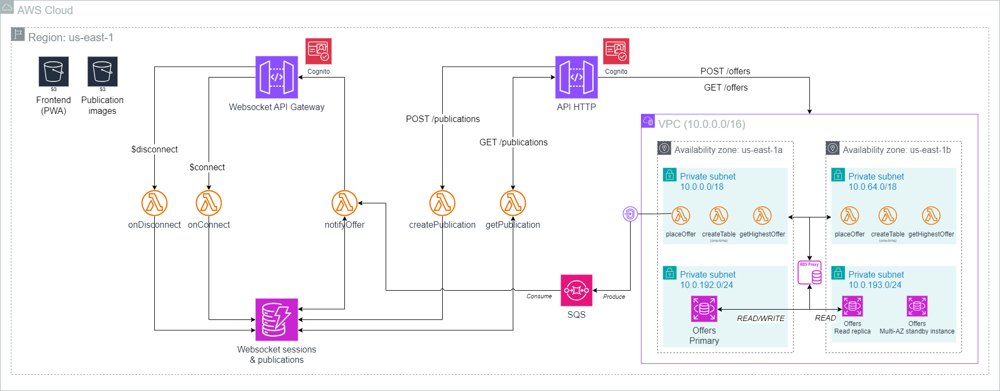

# Entrega 02: Terraform IaC
# Arquitectura



## Módulos utilizados
### Módulos externos
- **[vpc](https://registry.terraform.io/modules/terraform-aws-modules/vpc/aws/latest)**:
  Módulo para la creación de VPC y sus subredes.
- **[security group](https://registry.terraform.io/modules/terraform-aws-modules/security-group/aws/latest)**:
  Módulo para la creación de grupos de seguridad.
- **[s3-bucket](https://registry.terraform.io/modules/terraform-aws-modules/s3-bucket/aws/latest)**:
  Módulo para la creación de buckets S3.

### Módulos propios
- **[vpcEndpoint](backend/iacModules/vpcEndpoint)**:
  Módulo para la creación de VPC endpoints.

## Funciones y meta-argumentos utilizados
- **[formatlist](https://developer.hashicorp.com/terraform/language/functions/formatlist)**
- **[cidrsubnet](https://developer.hashicorp.com/terraform/language/functions/cidrsubnet)**
- **[jsonencode](https://developer.hashicorp.com/terraform/language/functions/jsonencode)**
- **[join](https://developer.hashicorp.com/terraform/language/functions/join)**
- **[depends_on](https://developer.hashicorp.com/terraform/language/meta-arguments/depends_on)**
- **[for_each](https://developer.hashicorp.com/terraform/language/meta-arguments/for_each)**

# Deployar con Terraform
## Requisitos
- **[AWS CLI](https://docs.aws.amazon.com/cli/latest/userguide/getting-started-install.html)**
- **[Terraform](https://developer.hashicorp.com/terraform/install)**
- **[Node >= v20](https://nodejs.org/en/download/package-manager)**
- **[Yarn](https://classic.yarnpkg.com/lang/en/docs/install)**
- **[zip](https://www.tecmint.com/install-zip-and-unzip-in-linux/)**

## Perfil
Es importante notar que, por defecto, el proyecto  utiliza el perfil `cloud-lab-profile`, en vez de `default`. Por lo tanto, se tiene que configurar las credenciales necesarias en `~/.aws/credentials` de la siguiente manera:
```
[default]
aws_access_key_id=
aws_secret_access_key=
[cloud-lab-profile]
aws_access_key_id=${COMPLETAR}
aws_secret_access_key=${COMPLETAR}
aws_session_token=${COMPLETAR}
```

Una alternativa es sobrescribir la variable, agregando el siguiente campo en `backend/terraform.tfvars` y `frontend/terraform.tfvars`:
```
aws_profile=default
```

## Desplegar
Para desplejar la infraestructura completa, basta con ejecutar el siguiente comando:
```
./deploy.sh all
```

> [!WARNING]
> El despligue del backend va a tardar aproximadamente 45 mins. debido a las instancias RDS.

### Argumentos del script
**Seleccion del target deploy**

Se debe elegir que es lo que queremos deployar, ingresando una de las siguientes opciones:
- all
- frontend
- backend

**No hacer build del frontend**

Si se necesita actualizar la infraestructura del frontend, y el código de la aplicación no se modificó, para evitar buildearlo se puede utilizar el argumento opcional `--no-build`. Esto permitirá saltar este paso y utilizar el directorio `dist` existente en el ultimo build hecho. <u>Esto fallará si dicho directorio no existe</u>, ya sea porque el frontend nunca ha sido buildeado, o bien porque el directorio fue eliminado.
El comando quedaria asi:
```
./deploy.sh frontend --no-build
```

**No hacer build de las lambdas del backend**

Análogamente al caso anterior, para el despligue del backend, puede ser costoso compilar las lambdas cada vez que se quiere actualizar la infraestructura. Es por ello que tambien se puede hacer uso de la flag `--no-build`, ejecutando asi el siguiente comando:
```
./deploy.sh backend --no-build
```

### Advertancia
Al momento de desplegar la infraestructura, en caso de que falle la creación de algún bucket o el secreto con las credenciales de RDS, se sugiere cambiar el nombre del recurso. 
- Nombre del secreto con las credenciales RDS: `rds_credentials_secret_name` en `backend/terraform.tfvars`.
- Nombre del bucket S3 con las imagenes de las publicaciones: `s3_publication_bucket_name` en `backend/terraform.tfvars`.
- Nombre del bucket S3 que hostea la web app: `username` en `frontend/terraform.tfvars`.
